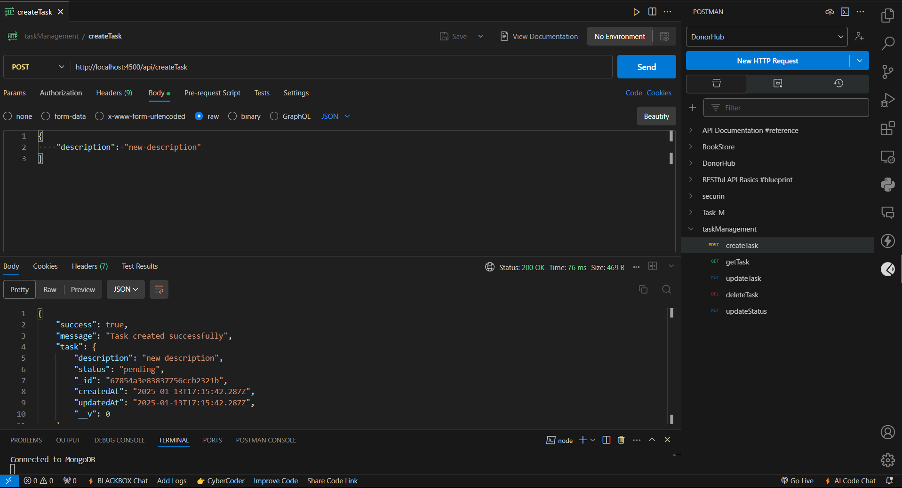
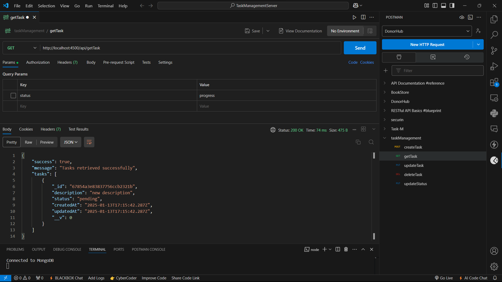
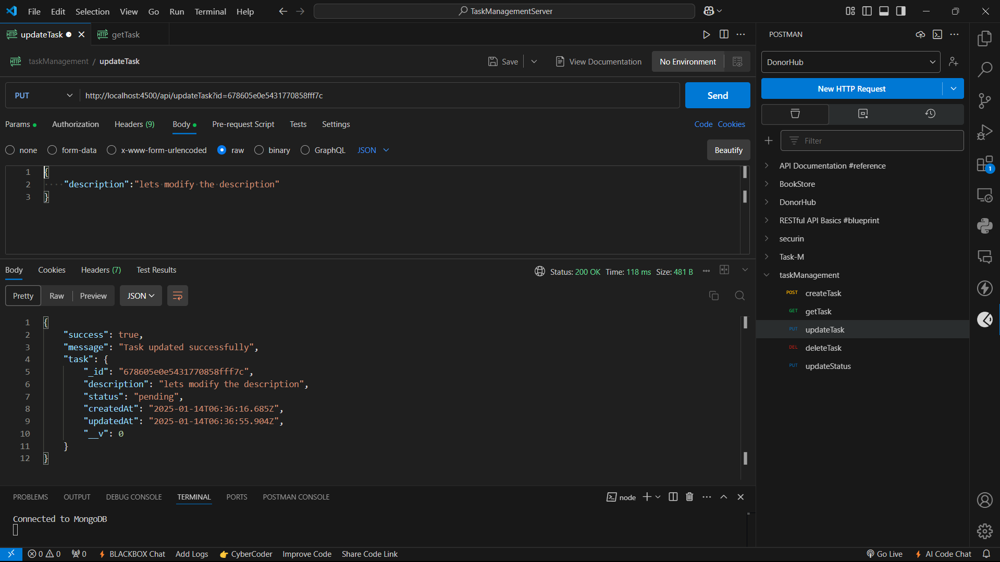
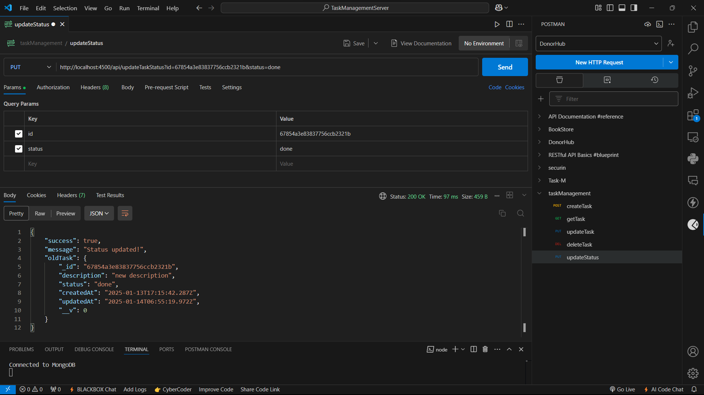
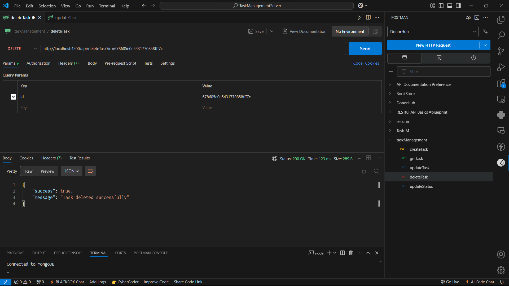
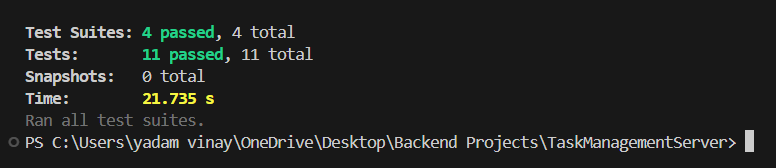

# Task Management Server

This project mainly aims to provide APIs for Task Management Application. Designed using conventional **MVC pattern**. Used **mongoose** for cloud database. Used **jest** and **supertest** for testing the controllers. Codes for testing each controller separately are available in test folder.

## Salient Features

- API to create task
- API to get all tasks
- API to get tasks by status(`pending`,`progress`,`done`,)
- API to update task
- API to update the status of the task separately
- API to delete task
- Unit test codes for all the controllers

## Install Packages and Run the App

After successfully cloning my GitHub Repo, type the below command in integrated terminal in the same directory as that of the project.

```bash
  npm i
```

- Create a `.env` file in the root directory.
- Add the following configuration:

```bash
 PORT=4500
 MONGODB_URI=your_mongodb_connection_string
```

- Run the server

```bash
  npm start
```

- Or for development:

```bash
  npm run dev
```

- Server will run at: http://localhost:4500

## API Reference

#### Create Task API

```http
  POST /api/createTask
```

- Provide description,status of the task in json format.
- Status is optional. If not passed, default value of pending is assigned.

| Parameter     | Type     | Description                            |
| :------------ | :------- | :------------------------------------- |
| `description` | `string` | **Required**. task description         |
| `status`      | `string` | any 1 of (`pending`,`progress`,`done`) |



#### Get all Tasks API

```http
  GET /api/getTask
```

- Status can be passed as query to fetch tasks based on status.
- If status is not passed, then all the tasks will be retrieved.

| Parameter | Type     | Description                            |
| :-------- | :------- | :------------------------------------- |
| `status`  | `string` | any 1 of (`pending`,`progress`,`done`) |



#### Update task API

```http
  PUT /api/updateTask
```

- Provide the id of the task as query.

| Query | Type     | Description          |
| :---- | :------- | :------------------- |
| `id`  | `string` | **Required** Task Id |

- Provide all the updated fields in the form of json.

| Parameter     | Type     | Description                            |
| :------------ | :------- | :------------------------------------- |
| `description` | `string` | **Required** task description          |
| `status`      | `string` | any 1 of (`pending`,`progress`,`done`) |



#### Update the status of task API

```http
  PUT /api/updateTask
```

- Provide the id and new status of the task as query.

| Query    | Type     | Description                            |
| :------- | :------- | :------------------------------------- |
| `id`     | `string` | **Required** Task Id                   |
| `status` | `string` | any 1 of (`pending`,`progress`,`done`) |



#### Delete task API

```http
  DELETE /api/deleteTask
```

- Provide the id of the task as query.

| Query | Type     | Description          |
| :---- | :------- | :------------------- |
| `id`  | `string` | **Required** Task Id |



## Running Tests

- Install Jest (if not already installed):

```bash
  npm install jest --save-dev
```

- Install Supertest (if not already installed):

```bash
  npm install supertest
```

- Update the `package.json` file
- runInBand is an additional command used to run tests parallely.

```
   "scripts": {
    "test": "jest --runInBand"
  }
```

- Run the tests:

```bash
  npm test
```

- Tests are located in the `__tests__` folder, including:

- Unit tests for `createTask` logic is present in `__tests__\createTask.test.js`.
- Unit tests for `getTask` logic is present in `__tests__\getTask.test.js`.
- Unit tests for `updateTask` logic is present in `__tests__\updateTask.test.js`.
- Unit tests for `deleteTask` logic is present in `__tests__\deleteTask.test.js`.



## Dependencies

- express: Fast and minimal web framework.
- mongoose: MongoDB object modeling.
- dotenv: Load environment variables.
- jest: JavaScript testing framework for unit testing.
- supertest: For testing HTTP requests.
